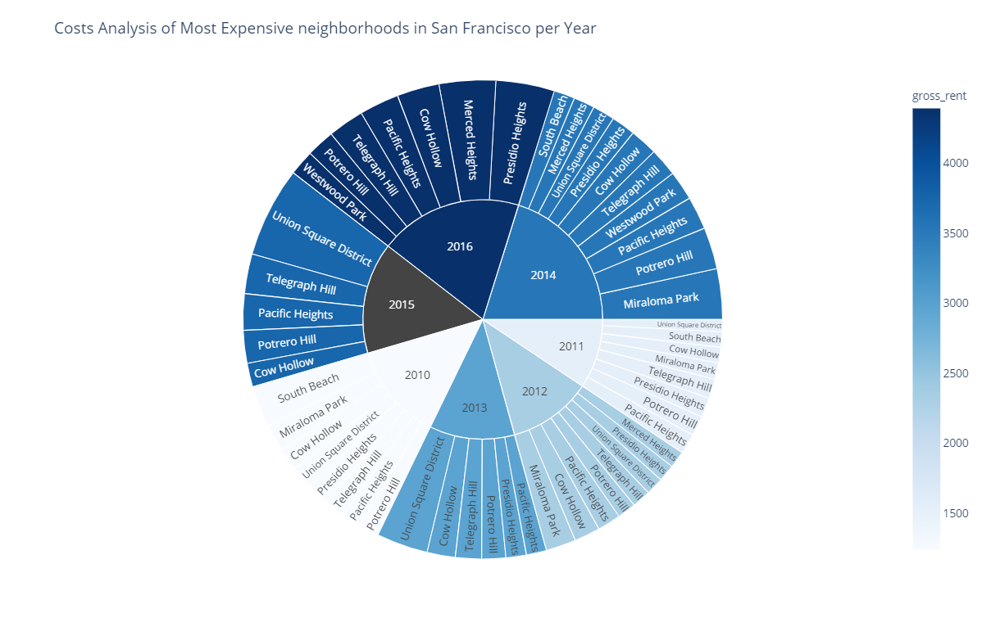

>## *Visualizing Population Subsets*  
#

 

#

>### Overview: 
>> This script will *Analyze* and *Create* Dashboards Visualizations based on San Francisco real estate pricing data

>> Panel & plotly will visualize detailed analysis about housing data for each neighborhood in San Francisco

#

>## What is PyViz?
> [PyViz](https://pyviz.org/index.html): The PyViz.org website is an open platform for helping users decide on the best open-source (OSS) Python data visualization tools for their purposes, with links, overviews, comparisons, and examples..

#

>

 

#

#

#

## Resources:
1. Northwestern NPS:
https://sps.northwestern.edu/

2. PyViz:
https://pyviz.org/index.html.

